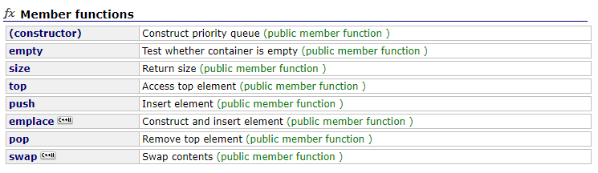

# std::priority_queue

## 1 简介

`std::priority_queue` 对应数据结构中的堆。


```c++
template<class _Ty, class _Container = vector<_Ty>, class _Pr = less<typename _Container::value_type> >
class priority_queue;
```

`priority_queue` 模板有三个参数。

* 第一个参数是存储对象的类型；
* 第二个参数是存储元素的底层容器；
* 第三个参数是函数对象。默认是 `std::less<_Container::value_type>`，也即大根堆。当设为 `std::greater<_Container::value_type>`时即为小根堆。


priority_queue 数据排列和检索示意图：


`std::priority_queue`可以使用其他容器来保存元素，只要容器支持随机访问迭代器，并有成员函数 ：

* `front()`

* `push_back()`

* `pop_back()`

* `size()`

* `empty()`

显然，`std::deque` 也能作为 `std::priority_queue` 的存储容器。

 

`std::priority_queue` 的成员函数：




## 2 Demo

```c++
// std::priority_queue init constructor
#include <iostream>
#include <queue>

void main()
{
	std::vector<int> v = { 10, 20, 50, 30, 7 };
	std::priority_queue<int> pq(std::less<int>(), v);

	while (!pq.empty())
	{
		std::cout << pq.top() << std::endl;   // 50 30 20 10 7
		pq.pop();
	}
	system("pause");
}
```


```c++
// std::priority_queue range constructor
#include <iostream>
#include <queue>
#include <string>

void main() 
{
	std::string words[] = { "one", "two", "three", "four" };
	std::priority_queue<std::string> ps(std::begin(words), std::end(words));
	std::cout << "由大至小" << std::endl;
	while (!ps.empty())
	{
		std::cout << ps.top() << "  ";
		ps.pop();
	}
	std::cout << std::endl;

	std::priority_queue<std::string, std::vector<std::string>, std::greater<std::string> > reverse_ps(std::begin(words), std::end(words));
	std::cout << "由小至大" << std::endl;
	while (!reverse_ps.empty())
	{
		std::cout << reverse_ps.top() << "  ";
		reverse_ps.pop();
	}
	std::cout << std::endl;

	system("pause");
}
```


```c++
// std::priority_queue 可选择 std::vector 之外的类作为存储容器，比如 std::deque
#include <iostream>
#include <queue>
#include <deque>
#include <string>

void main()
{
	std::string words[] = { "one", "three", "five" };
	std::priority_queue<std::string, std::deque<std::string>> pq(std::begin(words), std::end(words));
	pq.emplace("six");
    
	while (!pq.empty())
	{
		std::cout << pq.top() << "  ";  // three  six  one  five
		pq.pop();
	}
	std::cout << std::endl;
	system("pause");
}
```


## 3 参考

[c++ priority_queue](http://www.cplusplus.com/reference/queue/priority_queue/)

[priority_queue 用法详解](http://c.biancheng.net/view/480.html)

