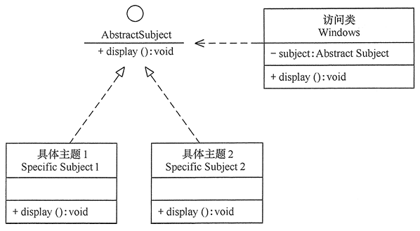

# 设计模式

## 1 简介

面向对象结合设计模式，能使软件系统变得：

* 可维护
* 可复用
* 可拓展
* 灵活性好

从而提高软件开发效率，节约软件开发成本和维护成本。

### 1.1 设计模式基于六大原则

* 开闭原则 （Open Close Principle）
* 单一职责原则
* 里氏替换原则
* 依赖倒置原则
* 迪米特法则
* 接口隔离原则 (Interface Segregation Principle)

#### 1.1.1 开闭原则

**开闭原则的定义** ：软件实体应当对扩展开放，对修改关闭（Software entities should be open for extension，but closed for modification），这就是开闭原则的经典定义。

这里的软件实体包括以下几个部分：

* 项目中划分出的模块

* 类与接口

* 方法

**开闭原则的含义**：当应用的需求改变时，在不修改软件实体的源代码或二进制代码的前提下，可扩展模块的功能，使其满足新的需求。

**开闭原则的作用**：

* 提高软件测试的效率：遵循开闭原则的软件，测试时只需要对拓展的代码进行测试就可以了，原有的测试代码仍可正常运行。
* 提高代码的可复用性：粒度越小，被复用的可能性就越大。
* 提高软件的可维护性：遵循开闭原则的软件，其稳定性和延续性强，易于拓展和维护。

**开闭原则的实现方法**：

可通过 “抽象约束、封装变化” 来实现开闭原则，也就是通过接口或者抽象类为软件实体定义一个相对稳定的抽象层，而将可变因素封装在具体实现类中。

因为抽象灵活性好，适应性广，只要抽象得合理，基本可以保持软件架构的稳定。

软件中易变的细节可以从抽象派生除的实现类中进行扩展。当软件需要发生变化时，只需要根据需求重新派生一个具体类就可以了。

 
示例图1：Windows 的桌面主题类

（2）单一职责原则 ：一个类只做一件事，一个类应该只有一个引起它修改的原因。

（3）里氏替换原则 ：派生类应该可以完全替换基类。也就是在使用继承时，只拓展新功能，不要破坏基类原有的功能。

（4）依赖倒置原则 ：细节应该依赖于抽象，抽象不应依赖于细节。把抽象层放在程序设计的高层，并保持稳定，程序的细节变化由低层的实现层来完成。

（5）迪米特法则 ：又称【最少知道原则】，一个类不应知道自己操作的类的细节。换言之，只和朋友谈话，不和朋友的朋友谈话。

（6）接口隔离原则 ：要求程序员尽量将臃肿庞大的接口拆分成更小的和更具体的接口，让接口中只包含客户感兴趣的方法。

## 参考

* [开闭原则](http://c.biancheng.net/view/1322.html)
* 

